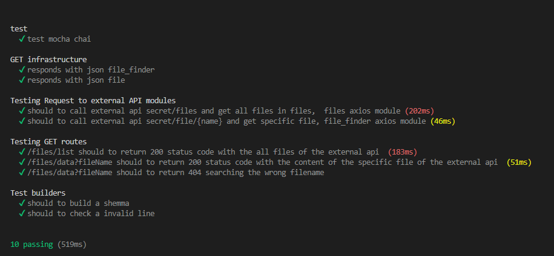

# Getting Started with Create React App

## Available Scripts

In the project directory, run this scripts for start the App :

1. Clone the project:
Back-End:
```terminal
git clone https://github.com/geovannyC/server-toolbox-app.git
```
Front-End:
```terminal
git clone https://github.com/geovannyC/front-toolbox-app.git
```

2. Install dependences :
`NAVIGATE TO SERVER DIRECTORY cd server-toolbox-app`
```terminal
cd server-toolbox-app
```
   `INSTALL DEPENCENCES`
```terminal
npm install
```
3. Install dependences :
`NAVIGATE TO FRONT DIRECTORY cd front-toolbox-app`
```terminal
cd front-toolbox-app
```
   `INSTALL DEPENCENCES`
```terminal
npm install
```
4. Launch the project:
`SERVER FOLDER`
   `START`
```terminal
npm start
```
`FRONT FOLDER`
   `START`
```terminal
npm start
```

Runs the app in the development mode.\
Open [http://localhost:3000](http://localhost:3000) to view it in your browser.

5. Launcher the test runner:
`SERVER FOLDER`
   `START`
```terminal
npm run test
```
`FRONT FOLDER`
   `START`
```terminal
npm run test
```

- [**app**](app)
    - [**main**](app/main)
        - [**file_finder**](app/main/file_finder)
            - [**infrastructure**](app/main/file_finder/infrastructure)
                - [**controller**](app/main/file_finder/infrastructure/controller)
                - [**routes**](app/main/file_finder/infrastructure/routes)
        - [**files**](app/main/files)
            - [**infrastructure**](app/main/files/infrastructure)
                - [**controller**](app/main/files/infrastructure/controller)
                - [**routes**](app/main/files/infrastructure/routes)
- [**evidence**](evidence)
- [**test**](test)

<div align="center">
	<h1 >Result Testing</h1>
		
</div>

